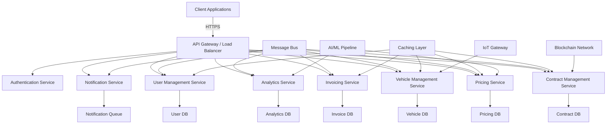
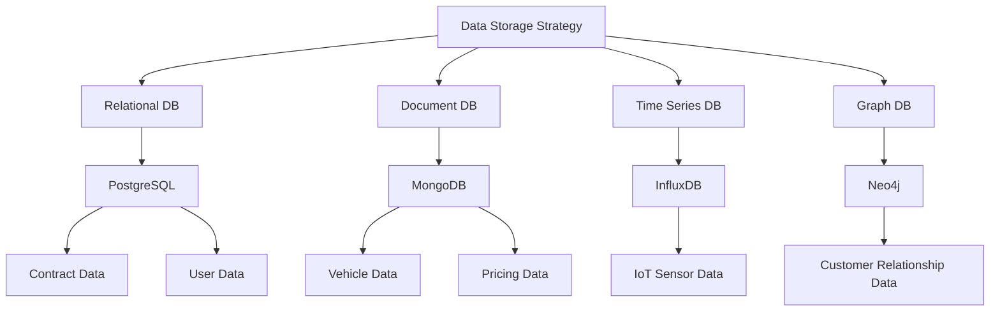
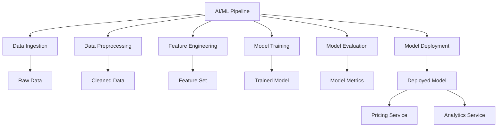
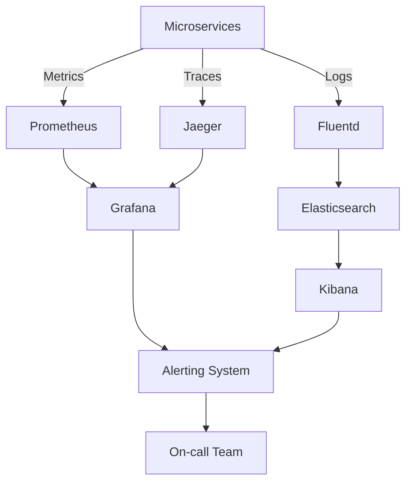

# Service Contract Management System - Detailed Architecture and Design
### By Gurmeet Singh

## 1. Executive Summary

As a seasoned software architect, I, Gurmeet Singh, have designed this comprehensive architecture for an innovative Service Contract Management System tailored for car dealerships. My vision is to create a scalable, cloud-native solution capable of selling and managing service contracts across various countries, while accommodating local taxation and laws. By leveraging cutting-edge technologies and forward-thinking design principles, I aim to revolutionize how car dealerships handle service contracts.

## 2. System Overview

The Service Contract Management System I've designed is a state-of-the-art, cloud-based application that empowers car dealers to configure, sell, and manage a wide array of service contracts. I've built this system with flexibility, scalability, and user experience at its core.

Key Features I've Incorporated:
- Dynamic contract configuration and pricing
- AI-powered coverage recommendations
- Real-time vehicle health monitoring integration
- Blockchain-based contract validation
- Predictive analytics for contract pricing optimization
- Multi-country and multi-language support
- Mobile-first design with progressive web app (PWA) capabilities

## 3. Detailed Architecture

I've adopted a microservices architecture, leveraging containerization and serverless computing to ensure maximum scalability and resource efficiency. 

### 3.1 Client Applications
I've designed the client applications with a focus on accessibility and user experience:
- Progressive Web App (PWA) for cross-platform compatibility
- Native mobile apps for iOS and Android
- Dealer management console (web-based)

### 3.2 API Gateway / Load Balancer
To ensure robust and secure communication, I've implemented:
- Rate limiting and request throttling
- API versioning
- SSL termination

### 3.3 Microservices
I've containerized each microservice using Docker and orchestrated with Kubernetes for efficient scaling and management.

#### 3.3.1 Authentication Service
Security is paramount in my design:
- OAuth 2.0 and OpenID Connect implementation
- Multi-factor authentication (MFA) support
- Integration with external identity providers (e.g., Google, Microsoft)

#### 3.3.2 Contract Management Service
I've focused on flexibility and transparency:
- Contract lifecycle management (creation, updates, termination)
- Blockchain integration for immutable contract records
- Event sourcing for auditing and historical analysis

#### 3.3.3 Pricing Service
My pricing service is designed for accuracy and adaptability:
- Real-time pricing calculations based on multiple factors
- Machine learning model for dynamic pricing optimization
- A/B testing capabilities for pricing strategies

#### 3.3.4 Vehicle Management Service
I've incorporated IoT integration for real-time insights:
- Real-time integration with IoT devices for vehicle health monitoring
- Predictive maintenance recommendations
- Support for various data import formats (CSV, XML, JSON, etc.)

#### 3.3.5 Invoicing Service
My invoicing service is designed for flexibility and future-proofing:
- Generation of invoices for one-time and recurring payments
- Integration with multiple payment gateways
- Support for cryptocurrencies for payments

#### 3.3.6 User Management Service
I've prioritized security and auditability:
- Role-based access control (RBAC) with fine-grained permissions
- Self-service portal for user management
- Audit logging for all user activities

#### 3.3.7 Notification Service
My notification service ensures timely and personalized communication:
- Multi-channel notifications (Email, SMS, Push Notifications)
- Templating engine for personalized communications
- Scheduling and batching of notifications for optimal delivery

#### 3.3.8 Analytics Service
I've designed the analytics service to provide actionable insights:
- Real-time dashboards and reporting
- Predictive analytics for contract renewals and upselling opportunities
- Integration with big data processing tools for complex analyses

### 3.4 Data Storage
I've implemented a polyglot persistence strategy:
- Appropriate databases chosen for each microservice
- Data partitioning and sharding for improved performance

### 3.5 Caching Layer
To optimize performance, I've implemented:
- Distributed caching using Redis
- Multi-level caching strategy (application-level, database-level, CDN)

### 3.6 Message Bus
For reliable, high-throughput message streaming, I've chosen:
- Apache Kafka to enable event-driven architecture and microservices communication

### 3.7 Blockchain Network
To enhance security and transparency, I've incorporated:
- Private Ethereum network for immutable contract records
- Smart contracts for automated contract execution and validation

### 3.8 IoT Gateway
For real-time vehicle data processing, I've designed:
- A gateway to manage connections with vehicle IoT devices
- Edge computing implementation for real-time data processing

### 3.9 AI/ML Pipeline
To leverage the power of machine learning, I've included:
- TensorFlow serving for machine learning model deployment
- Continuous training pipeline for model improvement

## 4. Innovative Features

### 4.1 AI-Powered Contract Recommendations
I've implemented machine learning algorithms to analyze customer data, vehicle usage patterns, and historical contract performance to recommend the most suitable service contracts for each customer.

### 4.2 Blockchain-Based Contract Validation
By storing contract hashes on a private blockchain network, my system ensures the integrity and immutability of all service contracts, providing an additional layer of trust and security.

### 4.3 Real-Time Vehicle Health Monitoring
I've integrated IoT devices installed in vehicles to allow for real-time monitoring of vehicle health. This data is used to provide predictive maintenance alerts and can trigger automatic contract adjustments if needed.

### 4.4 Dynamic Pricing Optimization
The pricing engine I've designed uses machine learning models to optimize contract pricing in real-time based on factors such as vehicle condition, usage patterns, market trends, and competitor pricing.

### 4.5 Augmented Reality (AR) Assisted Inspections
For in-person vehicle inspections, I've included an AR module that guides technicians through the inspection process, ensuring consistency and accuracy in vehicle assessments.

## 5. Security Considerations

I've prioritized security throughout the system design:

### 5.1 Zero Trust Security Model
- Implementation of the principle of least privilege
- Continuous authentication and authorization
- Micro-segmentation of the network

### 5.2 Data Protection
- End-to-end encryption for data in transit and at rest
- Data anonymization and pseudonymization for analytics
- Regular security audits and penetration testing

### 5.3 Compliance
- GDPR compliance for handling EU customer data
- PCI DSS compliance for payment processing
- ISO 27001 certification for information security management

## 6. Scalability and Performance

To ensure the system can handle growing demand, I've implemented:

### 6.1 Horizontal Scaling
- Auto-scaling of microservices based on demand
- Use of serverless functions for sporadic workloads

### 6.2 Database Optimization
- Database sharding for improved read/write performance
- Indexing strategies tailored for each microservice's data access patterns

### 6.3 Caching Strategy
- Multi-level caching (CDN, Application, Database)
- Cache invalidation mechanisms to ensure data consistency

## 7. Disaster Recovery and High Availability

I've designed robust disaster recovery and high availability measures:

### 7.1 Multi-Region Deployment
- Active-active setup across multiple geographic regions
- Global load balancing for traffic distribution

### 7.2 Backup and Recovery
- Automated daily backups with point-in-time recovery
- Regular disaster recovery drills

### 7.3 Chaos Engineering
- Simulated failure scenarios to test system resilience
- Automated recovery procedures

## 8. Monitoring and Observability

I've implemented comprehensive monitoring and observability:

- Distributed tracing with Jaeger
- Metrics collection with Prometheus
- Log aggregation with ELK stack (Elasticsearch, Logstash, Kibana)
- Real-time alerting and incident management

## 9. Development and Deployment

To streamline development and deployment, I've designed:

### 9.1 GitOps Workflow
- Infrastructure as Code (IaC) using Terraform
- CI/CD pipelines with Jenkins or GitLab CI
- Blue-green deployments for zero-downtime updates

### 9.2 Developer Experience
- Local development environments using Docker Compose
- Automated code quality checks and security scans
- Comprehensive API documentation with Swagger/OpenAPI

## 10. Future Roadmap

Looking ahead, I envision the following enhancements:

- Integration with autonomous vehicle systems for automated contract adjustments
- Implementation of quantum-resistant cryptography for long-term security
- Expansion into predictive insurance models based on real-time vehicle data
- Integration with smart city infrastructure for enhanced service offerings

As the architect of this system, I, Gurmeet Singh, believe this detailed architecture and design provide a robust foundation for building an innovative Service Contract Management System. It addresses current requirements while incorporating cutting-edge technologies and forward-thinking features to ensure the system remains competitive and valuable in the evolving automotive industry.
